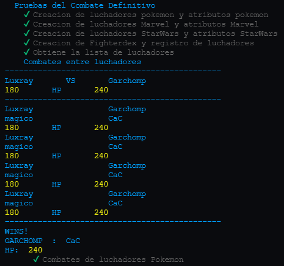
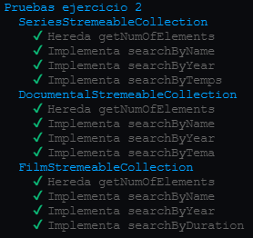
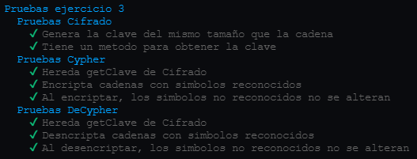
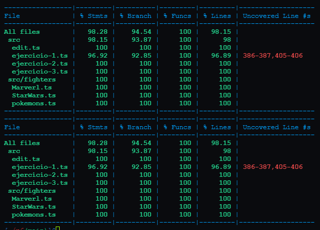
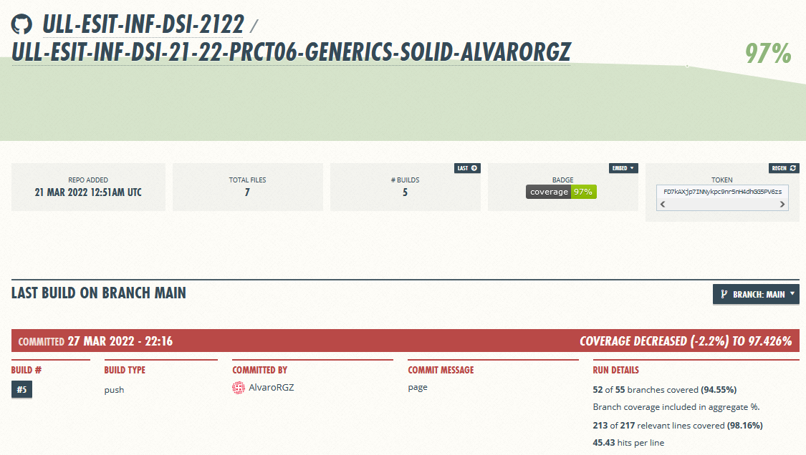

# Práctica 6 - DSI
## Clases e interfaces genericas


### Índice de ejercicios

-[Ejercicio 1  - Combate Definitivo](#e1)<br>
-[Ejercicio 2 - DSIFLIX](#e2)<br>
-[Ejercicio 3 - El cifrado indescifrable](#e3)<br>
-[Datos Instambul](#e4)<br>
-[Datos Coveralls](#e5)<br>

### Introducción

En este nuevo proyecto, emplearemos un desarrollo dirigido por pruebas (TDD) y estará documentado, para lo 
que vamos a valernos de tres herramientas para llevarlo a cabo:

* [Mocha](https://mochajs.org/) y [Chai](https://www.chaijs.com/): para incorporar TDD.
* [Typedoc](https://typedoc.org/): para realizar la documentación automática de nuestro codigo.
* [Instambul](https://istanbul.js.org/) Para mostrarnos los datos de cubrimiento de nuestros test.
* [Coveralls](https://coveralls.io/) Para llevar el seguimiento de `Instambul` en nuestro repositorio.

Continuaremos con la misma estructura de directorios basada en las anteriores prácticas, añadiendo el nuevo
directorio `test` para alojar las expectativas del código y `Typedocumentation` para almacenar la
documentación generada por `Typedoc`.

Con todo esto implementaremos 10 funciones propuestas, repasando conceptos sobre los apartados vistos en 
clase:
* [Creación de un proyecto inicial con Typescript](https://ull-esit-inf-dsi-2122.github.io/typescript-theory/typescript-project-setup.html)
* [Tipos de datos estáticos](https://ull-esit-inf-dsi-2122.github.io/typescript-theory/typescript-static-types.html)
* [Funciones](https://ull-esit-inf-dsi-2122.github.io/typescript-theory/typescript-functions.html)
* [Arrays, tuplas y enumerados](https://ull-esit-inf-dsi-2122.github.io/typescript-theory/typescript-arrays-tuples-enums.html)
* [Objetos, clases e interfaces](https://ull-esit-inf-dsi-2122.github.io/typescript-theory/typescript-objects-classes-interfaces.html)

<a name="e1"></a>
## Ejercicio 1 - Combate Definitivos

Con estas clases implementaremos combates entre luchadores de diferentes universos

**Tipos de luchadores**
```Typescript
/**
 * Tipos generales entre universos
 */
type type = 'aDistancia' | 'CaC' | 'magico' | 'robot';

/**
 * Tipos de luchadores en Pokemon
 */
type tPokemon = 'agua' | 'electrico' | 'fuego' | 'planta'; 
/**
 * Tipo de luchadores en Marvel
 */
type tMarvel = 'bueno' | 'malo';
/**
 * Tipos de luchadores en StarWars
 */
type tStarWars = 'claro' | 'oscuro';

```

**Clase abstracta de luchador** 
```Typescript
export class Fighter {
  /**
 *  Representa los datos basicos de un luchador
 *  @param nombre nombre
 *  @param catchingPhrase frase iconica
 *  @param tipo tipo general de luchador
 *  @param ataque ataque
 *  @param defensa defensa
 *  @param vida vida maxima
 *  @param peso peso
 *  @param altura altura
 *  @param velocidad velocidad del luchador
 */
  constructor(
    protected nombre: string,
    protected catchingPhrase: string,
    protected tipo: type,
    protected ataque: number,
    protected defensa: number,
    protected vida: number,
    protected peso: number,
    protected altura: number,
    protected velocidad: number){}

  /**
   * @returns el nombre del luchador
   */
  getNombre(): string {
    return this.nombre;
  }
    /**
   * @returns el tipo del luchador
   */
  getTipo(): type {
    return this.tipo;
  }
    /**
   * @returns la vida del luchador
   */
  getVida(): number {
    return this.vida;
  }
    /**
   * @returns el ataque del luchador
   */
  getAtaque(): number {
    return this.ataque;
  }
    /**
   * @returns la defensa del luchador
   */
  getDefensa(): number {
    return this.defensa;
  }
    /**
   * @returns la frase iconica del luchador
   */
  getCatchingPhrase(): string {
    return this.catchingPhrase;
  }
    /**
     *  @param daño daño inflingido
     *  le resta a la vida el daño infligido
   */
  restVida(daño: number ) {
    this.vida -= daño;
  }
    /**
   * @param vida actualiza la vida a ese valor
   */
  setVida(vida: number ) {
    this.vida = vida;
  }
  
  /**
   * Muestra los datos del luchador
   * */
  showStatus(){
    console.log(this.nombre.toUpperCase(), ' : ', this.tipo);
    console.log('HP: ', this.vida);
  }
}
```

**Universo Pokemon**
```Typescript
export class UniversePokemon extends Fighter {
  /**
 *  Representa los datos basicos de un luchador
 *  @param nombre nombre
 *  @param catchingPhrase frase iconica
 *  @param tipo tipo general de luchador
 *  @param ataque ataque
 *  @param defensa defensa
 *  @param vida vida maxima
 *  @param peso peso
 *  @param altura altura
 *  @param velocidad velocidad del luchador
 *  @param tipologia tipo de pokemon
 */
  constructor(
    nombre: string,
    catchingPhrase: string,
    tipo: type,
    ataque: number,
    defensa: number,
    vida: number,
    peso: number,
    altura: number,
    velocidad: number,
    private tipologia: tPokemon){
    catchingPhrase += ' y soy un pokemon';    
    super(nombre, catchingPhrase, tipo, ataque, defensa, 
            vida, peso, altura, velocidad);
    }
}
```

**Universo Marvel**

```Typescript
export class UniverseMarvel extends Fighter {
    /**
 *  Representa los datos basicos de un luchador
 *  @param nombre nombre
 *  @param catchingPhrase frase iconica
 *  @param tipo tipo general de luchador
 *  @param ataque ataque
 *  @param defensa defensa
 *  @param vida vida maxima
 *  @param peso peso
 *  @param altura altura
 *  @param velocidad velocidad del luchador
 *  @param bando bando de luchador 
 */
  constructor(
    nombre: string,
    catchingPhrase: string,
    tipo: type,
    ataque: number,
    defensa: number,
    vida: number,
    peso: number,
    altura: number,
    velocidad: number,
    private bando: tMarvel){
    
      catchingPhrase += ' y soy del universo Marvel'; 
      super(nombre, catchingPhrase, tipo, ataque, defensa, 
        vida, peso, altura, velocidad);   
    }
}
```

**Universo StarWars**
```Typescript
export class UniverseStarWars extends Fighter {
    /**
 *  Representa los datos basicos de un luchador
 *  @param nombre nombre
 *  @param catchingPhrase frase iconica
 *  @param tipo tipo general de luchador
 *  @param ataque ataque
 *  @param defensa defensa
 *  @param vida vida maxima
 *  @param peso peso
 *  @param altura altura
 *  @param velocidad velocidad del luchador
 *  @param lado tlado del luchador
 */
  constructor(
    nombre: string,
    catchingPhrase: string,
    tipo: type,
    ataque: number,
    defensa: number,
    vida: number,
    peso: number,
    altura: number,
    velocidad: number,
    private lado: tStarWars){
      catchingPhrase += ' y soy del universo StarWars';  
      super(nombre, catchingPhrase, tipo, ataque, defensa, 
        vida, peso, altura, velocidad);  
    }
}
```

**FighterDex**
Representa la lista de luchadores permitidos
```Typescript
export class Fighterdex {
  /**
   * 
   * @param list_ vector de luchadores permitidos
   */
  constructor(private list_: Fighter[]){}
  /**
   * 
   * @param p luchador a buscar en la lista
   * @returns si esta o no en la lista
   */
  isRegistered(p: Fighter): boolean {
    return this.list_.includes(p);
  }
  /**
   * 
   * @returns la lista de candidatos
   */
  getList(): Fighter[] {
    return this.list_;
  }
}
```

**Clase Combate**
Representa y simula un combate entre dos luchadores
```Typescript
export class Combat {
  /**
   * 
   * @param p1 luchador 1
   * @param p2 luchador 2
   */
  constructor(private p1: Fighter, private p2: Fighter){}
              // private candidates: Pokedex) {

  /**
   * 
   * @param p1 atacante
   * @param p2 defensor
   * @returns daño real del ataque
   */
  dañoReal(p1: Fighter, p2: Fighter) {
    let efectividad: number = 1;
    const fuerteContraCaC: type[] = ['aDistancia'];
    const debilContraCaC: type[] = ['robot'];

    const fuerteContraADistancia: type[] = ['robot', 'magico'];
    const debilContraADistancia: type[] = ['CaC'];

    const fuerteContraMagico: type[] = ['robot'];
    const debilContraMagico: type[] = ['CaC'];

    const fuerteContraRobot: type[] = ['CaC'];
    const debilContraRobot: type[] = ['aDistancia'];

    console.log('T1 = ', p1.getTipo());
    console.log('T2 = ', p2.getTipo());
    if (p1.getTipo() === p2.getTipo()) {
      return 50 * (p1.getAtaque() / p2.getDefensa()) * 0.5;
    }

    switch (p1.getTipo()) {
      case 'CaC': {
        if (fuerteContraCaC.includes(p2.getTipo())) {
          efectividad = 0.5;
        } else if (debilContraCaC.includes(p2.getTipo())) {
          efectividad = 2;
        }
        break;
      }
      case 'aDistancia': {
        if (fuerteContraADistancia.includes(p2.getTipo())) {
          efectividad = 0.5;
        } else if (debilContraADistancia.includes(p2.getTipo())) {
          efectividad = 2;
        }
        break;
      }
      case 'magico': {
        if (fuerteContraMagico.includes(p2.getTipo())) {
          efectividad = 0.5;
        } else if (debilContraMagico.includes(p2.getTipo())) {
          efectividad = 2;
        }
        break;
      }
      case 'robot': {
        if (fuerteContraRobot.includes(p2.getTipo())) {
          efectividad = 0.5;
        } else if (debilContraRobot.includes(p2.getTipo())) {
          efectividad = 2;
        }
      }
      break;
    }
    return Math.floor(50 * (p1.getAtaque() / p2.getDefensa()) * efectividad);
  }

  /**
   * Muestra el estado del combate
   */
  showCombatStatus(){
    console.log(this.p1.getNombre(), '              ', this.p2.getNombre());
    console.log(this.p1.getTipo(), '              ', this.p2.getTipo());
    console.log(this.p1.getVida(), '      HP      ', this.p2.getVida());
  }
  /**
   * 
   * @param p muestra a P el ganador
   */
  showWinner(p: Fighter){
    console.log('----------------------------------------------');
    console.log('WINS!');
    p.showStatus();
  }
  /**
   * Simlua el combate por turnos, lo hace sin modificar la vida de los contricantes.
   * @returns el luchador ganador
   */
  start(): Fighter{
    let attacker: Boolean = true;
    let p1Wins: Boolean = false;
    let HP1: number = this.p1.getVida();
    let HP2: number = this.p2.getVida();

    console.log('----------------------------------------------');
    console.log(this.p1.getNombre(), '      VS      ', this.p2.getNombre());
    console.log(this.p1.getVida(), '      HP      ', this.p2.getVida());
    console.log('----------------------------------------------');

    while ( HP1 > 0 && HP2 > 0) {
      if (attacker) {
        if ((HP2 < this.dañoReal(this.p1, this.p2))) {
          HP2 = 0;
          p1Wins = true;
        } else {
          HP2 -= this.dañoReal(this.p1, this.p2);
        }
      } else {
        if ((HP1 < this.dañoReal(this.p2, this.p1))) {
          HP1 = 0;
          p1Wins = false;
        } else {
          HP1 -= this.dañoReal(this.p2, this.p1);
        }
      }
      this.showCombatStatus();
      attacker = !attacker;
    }
    
    if (p1Wins) {
      this.showWinner(this.p1);
      return this.p1;
    } else {
      this.showWinner(this.p2);
      return this.p2;
    }
  }
    /**
   * Simlua el combate por turnos, lo hace modificando la vida de los contricantes.
   * @returns el luchador ganador
   */
  startRestingHP(): Fighter{
    let attacker: Boolean = true;
    let p1Wins: Boolean = false;

    console.log('----------------------------------------------');
    console.log(this.p1.getNombre(), '      VS      ', this.p2.getNombre());
    console.log(this.p1.getVida(), '      HP      ', this.p2.getVida());
    console.log('----------------------------------------------');

    while ( this.p1.getVida() > 0 && this.p2.getVida() > 0) {
      if (attacker) {
        console.log(this.p1.getCatchingPhrase());
        if ((this.p2.getVida() < this.dañoReal(this.p1, this.p2))) {
          this.p2.setVida(0);
          p1Wins = true;
        } else {
          this.p2.restVida(this.dañoReal(this.p1, this.p2));
        }
      } else {
        console.log(this.p2.getCatchingPhrase());
        if ((this.p1.getVida() < this.dañoReal(this.p2, this.p1))) {
          this.p1.setVida(0);
          p1Wins = false;
        } else {
          this.p1.restVida(this.dañoReal(this.p2, this.p1));
        }
      }
      this.showCombatStatus();
      attacker = !attacker;
    }
    
    if (p1Wins) {
      this.showWinner(this.p1);
      return this.p1;
    } else {
      this.showWinner(this.p2);
      return this.p2;
    }
  }
}
```

**Pruebas**



Las pruebas aparecen separadas debido a que se muestra el combate por pantalla.

***

<a name="e2"></a>
## Ejercicio 2 - DSIFLIX

Representaremos las clases necesarias para representar colecciones de objetos estremeables como series, peliculas y documentales.
Implementaremos las clases manejadoras de estas listas, y las clases para representar estos diferentes objetos.

**Interfaces Genericas** para metodos necesarios
```Typescript
/**
 * Representa la interfaz para buscar un elemento segun el año
 */
export interface SearchableByYear<T> {
  searchByYear(year: number): T[];
}
/**
 * Representa la interfaz para buscar un elemento segun el nombre
 */
export interface SearchableByName<T> {
  searchByName(name:string): T[];
}
```

**Clase abstracta para una coleccion de objetos generica**
```Typescript
export abstract class BasicStreameableCollection<T> implements SearchableByName<T>, SearchableByYear<T> {
  /**
   * 
   * @param collection_ colleccion de estremeables
   */
  constructor(protected collection_: T[]){}
  /**
   * 
   * @returns numeros de elementos
   */
  getNumOfElements(): number {
    return this.collection_.length;
  }
  /**
   * 
   * @param year año para filtrar
   */
  abstract searchByYear(year: number): T[];
  /**
   * 
   * @param name nombre para filtrar
   */
  abstract searchByName(name:string): T[];
}
```

**Clase de coleccion de series**
```Typescript
export class SeriesStremeableCollection extends BasicStreameableCollection<Serie> {
  /**
   * 
   * @param collection_ lista de series
   */
  constructor(collection_: Serie[]){
    super(collection_);
  }
  /**
   * 
   * @param year año para filtrar
   * @returns vector de series filtradas
   */
  searchByYear(year: number): Serie[] {
    return this.collection_.filter((e) => e.getYear() === year);
  }
  /**
   * 
   * @param name nombre para filtrar 
   * @returns vector de series filtradas
   */
  searchByName(name: string): Serie[] {
    return this.collection_.filter((e) => e.getName() === name);
  }
  /**
   * 
   * @param n numero de temporadas para filtrar
   * @returns vector filtrado
   */
  searchByTemps(n: number): Serie[] {
    return this.collection_.filter((e) => e.getTemps() === n);
  }
}
```

**Clase decoleccion de documentales
```Typescript
export class DocumentalStremeableCollection extends BasicStreameableCollection<Documental> {
  /**
   * 
   * @param collection_ lista de documentales
   */
  constructor(collection_: Documental[]){
    super(collection_);
  }
  /**
   * 
   * @param year año par filtrar
   * @returns vector filtrado
   */
  searchByYear(year: number): Documental[] {
    return this.collection_.filter((e) => e.getYear() === year);
  }
  /**
   * 
   * @param name nombre para filtrar
   * @returns vector filtrado
   */
  searchByName(name: string): Documental[] {
    return this.collection_.filter((e) => e.getName() === name);
  }
  /**
   * 
   * @param tema tema para filtrar
   * @returns vector filtrado
   */
  searchByTema(tema: string): Documental[] {
    return this.collection_.filter((e) => e.getTema() === tema);
  }
}
```

**CLase de coleccion de Peliculas**
```Typescript
export class FilmStremeableCollection extends BasicStreameableCollection<Film> {
  /**
   * 
   * @param collection_ lista de peliculas
   */
  constructor(collection_: Film[]){
    super(collection_);
  }
  /**
   * @param year año para filtrar
   * @returns vector filtrado
   */
  searchByYear(year: number): Film[] {
    return this.collection_.filter((e) => e.getYear() === year);
  }
    /**
   * @param name nombre para filtrar
   * @returns vector filtrado
   */
  searchByName(name: string): Film[] {
    return this.collection_.filter((e) => e.getName() === name);
  }
    /**
   * @param n duracion para filtrar
   * @returns vector filtrado
   */
  searchByDuration(n: number): Film[] {
    return this.collection_.filter((e) => e.getDuracion() === n);
  }
}
```

**Clase abstracta para representar un objeto estremeable
```Typescript
abstract class Stremeable {
  /**
   * 
   * @param name_ nombre
   * @param year_ año
   */
  constructor(private name_: string, private year_: number){}
  /**
   * 
   * @returns año
   */
  getYear(): number {
    return this.year_;
  }
  /**
   * 
   * @returns nombre
   */
  getName(): string{
    return this.name_;
  }
}
```
**Clase Serie**
```Typescript
export class Serie extends Stremeable{
  /**
   * 
   * @param name_ nombre
   * @param year_ año
   * @param temps_ temporadas
   */
  constructor(name_: string, year_: number, private temps_: number){
    super(name_, year_);
  }
  /**
   * 
   * @returns n de teemporadas
   */
  getTemps(): number {
    return this.temps_;
  }
}
```

**Clase Pelicula**
```Typescript
export class Film extends Stremeable{
  /**
   * 
   * @param name_ nombre 
   * @param year_ año
   * @param duracion_ duracion 
   */
  constructor(name_: string, year_: number, private duracion_: number){
    super(name_, year_);
  }
  /**
   * 
   * @returns duracion
   */
  getDuracion(): number {
    return this.duracion_;
  }
}

```
**Clase documental**
```Typescript
export class Documental extends Stremeable{
  /**
   * 
   * @param name_ nombre
   * @param year_ año
   * @param tema_ tema
   */
  constructor(name_: string, year_: number, private tema_: string){
    super(name_, year_);
  }
  /**
   * 
   * @returns tema
   */
  getTema(): string {
    return this.tema_;
  }
}
```

**Pruebas**



***

<a name="e23"></a>
## Ejercicio 3 - El cifrado indescifrable

Implementaremos las clases para encriptar y desencriptar cadenas con una determinada clave segun el algoritmo caesar.
Que consiste en encriptar cada caracter con el caracter que le corresponde en la posicion del alfabeto según un desplazamiento, este se obtiene 
aplicando Cifrado César a una letra del mensaje utilizando como desplazamiento la posición de la letra correspondiente de la clave 
dentro del alfabeto.

**Clase abstracta para construir el manejador de cadenas**
```Typescript
export abstract class Cifrado {
  /**
   * 
   * @param cadena_ cadena a procesar
   * @param clave_ clave
   * @param alfabeto_ alfabeto reconicido
   */
  constructor(protected cadena_: string, protected clave_: string, protected alfabeto_: string) {
     this.clave_ = this.buildClave(clave_);
  }
  /**
   * 
   * @param clave clave a procesar
   * @returns nueva clave del tamaño de la cadena
   */
  buildClave(clave: string): string {
    const words: number = Math.floor(this.cadena_.length / this.clave_.length);
    const left: number = this.cadena_.length % this.clave_.length;
    return this.clave_.repeat(words) + this.clave_.substring(0, left);
  }
  /**
   * 
   * @returns la clave utilizada
   */
  getClave(): string {
    return this.clave_;
  }

}
```

**Clase encargada de encriptar cadenas**
```Typescript
export class Cypher extends Cifrado {
  /**
   * 
   * @param cadena_ cadena a encriptar
   * @param clave_ clave utilizada
   * @param alfabeto_ alfabeto reconocido
   */
  constructor(cadena_: string, clave_: string, alfabeto_: string) {
    super(cadena_, clave_, alfabeto_);
  }
  /**
   * 
   * @returns la cadena del mismo tamaño pero encriptada con Cesar
   */
  encriptar(): string {
    let result: string = '';
    for (let i = 0; i < this.cadena_.length; i++) {
      if (!this.alfabeto_.includes(this.cadena_[i])){
        // si no esta en el alfabeto se queda igual
        result += this.cadena_[i];
      } else {
        // te obtiene el caracter en la posicion de la suma de posiciones del caracter i de
        // la clave en la cadena
      result += this.alfabeto_[(this.alfabeto_.indexOf(this.clave_[i]) + this.alfabeto_.indexOf(this.cadena_[i])+ 1)
                % this.alfabeto_.length];
      }
    }
    return result;
  }
}
```

**Clase encargada de encriptar cadenas**
```Typescript
export class DeCypher extends Cifrado {
    /**
   * 
   * @param cadena_ cadena a desencriptar
   * @param clave_ clave utilizada
   * @param alfabeto_ alfabeto reconocido
   */
  constructor(cadena_: string, clave_: string, alfabeto_: string) {
    super(cadena_, clave_, alfabeto_);
  }
  /**
   * 
   * @returns la cadena desencriptada 
   */
  desencriptar(): string {
    let result: string = '';
    for (let i = 0; i < this.cadena_.length; i++) {
      if (!this.alfabeto_.includes(this.cadena_[i])){
        // si no esta en el alfabeto se queda igual
        result += this.cadena_[i];
      } else {
        // calculamos la posicion en el vector
        const reverse: number = this.alfabeto_.indexOf(this.cadena_[i]) - (this.alfabeto_.indexOf(this.clave_[i]) + 1);
        if (reverse < 0) {
          // si es negativa, se la restamos al tamaño para obtener la posicion circular
          result += this.alfabeto_[this.alfabeto_.length + reverse];
        } else {
          // si no simplemente usamos esa posicion
          result += this.alfabeto_[reverse];
        }
      }
    }
    return result;
  }
}
```

**Pruebas**




***

<a name="e4"></a>
## Coveralls



***

<a name="e5"></a>
## Instambul


